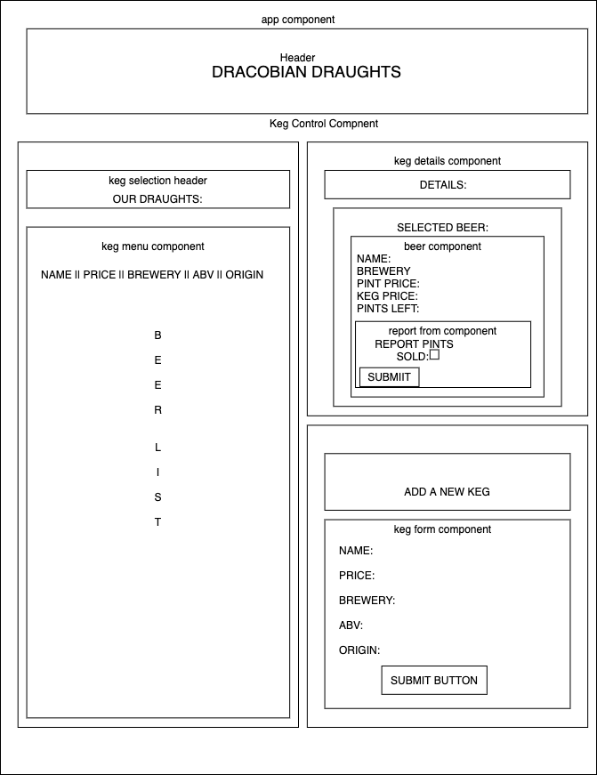
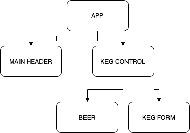

# Dracobian's Draughts

#### Friday Project for React Fundamentals, April, 24, 2020

#### _**Drake Wilcox**_

## User Stories: 

* A user should be able to see a list/menu of all available kegs, and see the name, brewery, abv, origin, and pint-price. 
* A user should be able to click on a keg and see the details for that keg. 
* A user should be able to see how many pints are left in a keg on from details section. 
* A user should be able to report sales and see the keg level descrease. The level should never go below zero. 
* When a keg is empty, the keg level should update to "Out of Stock". 

## Design and Development

#### WIREFRAME DESIGN:

#### COMPONENT TREE: 

## Setup/Installation Requirements

#### Node install

###### For macOS:
_If Homebrew is not installed on your computer already, then install Homebrew by entering the following two commands in Terminal:_
* $ /usr/bin/ruby -e "$(curl -fsSL https://raw.githubusercontent.com/Homebrew/install/master/install)"
* $ echo 'export PATH=/usr/local/bin:$PATH' >> ~/.bash_profile

_Install Git with the following command:_
* $ brew install git

_Next, install Node.js by entering the following command in Terminal:_
* $ brew install node

###### For Windows:
_Please visit the [Node.js website](https://nodejs.org/en/download/) for installation instructions._

#### Install this application

_Clone this repository via Terminal using the following commands:_
* _$ cd desktop_
* _$ git clone {url to this repository}_
* _$ cd tap-room
_Then, confirm that you have navigated to the tap-room project directory by entering "pwd" in Terminal._

_Next, install npm at the project's root directory via the following commands:_
* _$ npm install_
* _$ npm run build_

_Open the contents of the directory in a text editor or IDE of your choice (e.g., to open the contents of the directory in Visual Studio Code on macOS, enter the command "code ." in Terminal)._

## Technologies Used

* Git
* JavaScript
* npm
* Webpack
* React

### License

*This webpage is licensed under the MIT license.*

Copyright (c) 2020 **_Drake Wilcox_**
